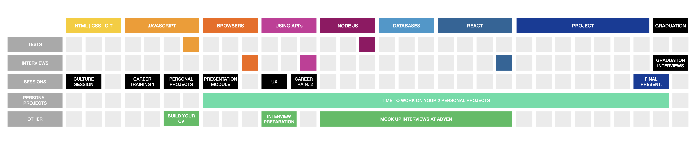

# Building your portfolio and proving you are a proactive developer


Being proactive is a crucial trait for any developer (and particularly important for a remote and/or junior developer). The last thing a company or a team wants is a developer who is always waiting for someone else to give them tasks or tell them what to do. Being proactive means thinking about the future and focusing on the things you can control instead of all those you cannot.

While there are many things you cannot control while building your career in Tech (i.e the condition of the job market, the willingness of companies to hire junior devs, the years of experience required by your dream job, etc) there are many other things that you can control. Becoming a proactive developer is one of them.

### In this repo we will discuss:
1. Why is proactivity crucial
2. Words are not enough
3. Working on projects
4. Frequently asked questions

## 1. Why is proactivity crucial

If you’re a development manager or a CTO (in a couple of years) and you want to do your job well, you need proactive developers working for you. Else, you’ll constantly have to hand-hold people, give approvals for the smallest things, assign new tasks, unblock people, etc. You’ll barely have time to do anything else! CTO’s and development managers want to focus on helping developers grow instead of pulling them along from task to task. For that, they need proactive people.

Companies are particularly concerned about proactivity when it comes to hiring junior developers. Non-proactive junior developers have a hard time growing into their role and most important of all, they sometimes require too much time from their more experienced team members to do the job. When you are being interviewed for a junior role, it is very important to prove that you are the proactive kind of developer!

Proactive developers can’t sit still. They hate being bored and can’t go without a task or a project for long. They’ll create their own tasks if none exist. They’re the developers who are never blocked and will either find ways to become unblocked or find ways to add value until they’re unblocked. Proactive developers are the ones who finish sprint items and then ask their team if anyone needs help. They constantly move projects and teams forward!

The same happens with proactive students: They can’t sit still! They read about coding and technology; They improve their communication and teamwork skills; They work in projects to improve their coding style and portfolio, to challenge themselves and to be more experienced at the time of graduation. These are the students that find jobs faster and build great careers for themselves.

To be successful in software development (especially as a junior developer) it helps to take initiative. This means going ‘above and beyond’ what is asked of you and making sure that things are done correctly and on time (indeed one of HackYourFuture’s [core values](https://www.hackyourfuture.net/values/)).

## 2. Words are not enough

Roughly all of HackYourFuture students claim that they are REALLY passionate about coding. They share with classmates, with mentors and with interviewers that they’ve found a new passion with HackYourFuture. We think this is AMAZING!

However, when presenting yourself to real interviewers, saying that you are passionate, or saying that you are proactive is not enough. You need to show how you are passionate and proactive. And the best way to do just that, is to actually work on projects next to your studies/work to show interviewers/recruiters/devs at the end of the program what you are capable of building.

But you might think...building more projects next to the program? Who has time for that? The answer is easy: Can you imagine a passionate and dedicated football player that doesn't play much football; Or a passionate piano player that doesn't play piano? Same applies to you: any recruiter or company would expect a passionate, proactive and dedicated web developer to build web-development projects.

Working on projects next to your study will help you to better understand concepts, improve your CV and portfolio (to get you hired faster) and most importantly will get you in a position in which being proactive is the only way forward: If you challenge yourself with projects, you will have to come up with ideas, seek for feedback, implement that feedback, and more. 

Companies expect entry level job seekers to not only write clean code and communicate well but also to have some experience and a portfolio of projects. For this reason is that from now on, every student will have to show a minimum of 2 great projects they’ve been working on next to their studies in order to graduate from our program.

## 3. Working on projects

### 3.1 Project Guidelines and examples
As mentioned before, every HackYourFuture student will have to show a minimum of 2 great projects they’ve been working on next to their studies in order to graduate. These projects should reflect your skills at the end of the program, and include enough features and refinement to show the HYF team and future employers what you can build by yourself.

### PROJECT 1: A full stack application
This would be a project to which you can keep adding to as you learn new things in the curriculum. Starting with a vanilla JS frontend with fake data, then building a backend without a database in Node, then adding a database in Databases and finally converting the frontend to a React frontend.

#### EXAMPLES:
- PetPlaats | MERN application: [LINK](https://github.com/nizamimursudlu/petplaats)
- ChatApp | Testing sockets/Firebase: [LINK](https://github.com/arsalanamanat/HackYourChatApp)

### PROJECT 2: A try-out application
During the curriculum you will hear about different libraries or technologies that we have left out of the scope. A proactive developer will want to try these things out and think of an application where they can do that. That means that you have a simple application as a playground to try out this technology.

#### EXAMPLES:
- Music Box | Music Visualizer: [LINK](https://github.com/George-Saad/Music-Box)
- Joke teller | Experimenting with the speech API: [LINK](https://dee-glitch.github.io/jokester/index.html)

### 3.2 When am I supposed to work on these projects?
We suggest you start thinking on these projects as soon as possible, but wait until the start of the Browsers module to start coding. You will have between 5-6 months to work on them, so we expect some great looking applications! Look at the curriculum planning for reference:



### 3.3 Getting feedback from mentors:
You can join a special Slack Channel named #projects where several mentors will be available to help you whenever you need some assistance in planning, building and improving your projects. You will have to be proactive in finding help from a mentor in this channel by sending a message. This will be 100% your responsibility. Remember to make sure that your question is complete and gives an idea of what you need! For example, a question like:

> My app is broken, what should I do?

will not get much of a response as it is very unclear what needs to happen. But if you add information for the mentor that allows them to have a quick look, they will be much more interested to help:

> I was adding a React frontend to my app and whenever I run the app I get the following error:
```
build.js:196 Uncaught TypeError: React.render is not a function
    at Object.2.react (build.js:196)
    at s (build.js:1)
    at e (build.js:1)
    at build.js:1
```
> Here is the repo with the error: https://link.to/repo

Additionally, you will be able to join Rob’s tech hour. A 1-2 hour weekly session where Rob will answer your questions and brainstorm together with you about your projects.

### 3.4 The final graduation interview:
The HYF team will do a final revision of your apps at the time of the graduation interview. We might ask you questions about what you’ve built and what you’ve learnt. For this, be sure your projects are deployed and added to your CV before the graduation interview. Failing to do this will be an impediment to graduate you and therefore, the program will be extended for you.

### 3.5 Evaluating your projects:
Some of the things we will look at in order to see how proactive you were in building these projects throughout the program are:

- Have you requested feedback from others and implemented that feedback?
- Is the app working flawlessly and following all recommendations for technical assignments discussed throughout the program?
- Have you worked on these apps through the course of the program, or you rushed these projects at the end only to graduate?
- Are you following the [Design Guidelines for HYF students' repo](https://github.com/HackYourFuture/design_guidelines), the learnings from the UX workshop and the [Technical Assignment Tips repo](https://github.com/riccardobevilacqua/technical-assignment-tips)?
- Are the apps deployed, added to your [CV and following the GitHub repo guidelines](https://github.com/HackYourFuture/yourpersonalbrand/blob/main/yourgithub.md) at the time of the final graduation interview?

## 4. Frequently asked questions:

#### - What should those 2 projects be about?
Anything you want as long as one is a full stack web application and the other one, a try out application as mentioned above. Think of this as an opportunity to build something that you always wanted to have or to try out some technology that you wanted to learn. The project does not have to be groundbreaking, you don’t have to create the next Facebook. Just make sure it is something doable and that it looks good both on the outside as well as the code.

#### - I worked on projects during the modules - Do these count? 
No they do not. The guided projects in the curriculum (HackYourWeather, HackYourRepo, etc) or the Browsers, Using API’s and React final projects do not count. This is about building something new for you to challenge yourself and apply the concepts you learn in a real world scenario.

#### - Can I follow a tutorial for a project?
No. A tutorial/code along on your CV does not fall in line with the Proactive developer. The project should be built from scratch. Also, when following a video tutorial or code-along, you might overestimate your skills. The real learnings come when struggling building things by yourself and for that reason, following tutorials is not allowed.

#### - Where can I get some ideas for projects?
Look for ideas online. Discuss ideas with mentors and colleagues...There are plenty of options! As a proactive developer you should be able to come up with some great ideas by yourself or brainstorm alone or with others until you find a project that gets you excited! 

#### - How can I get support if I'm stuck on my project?
On Slack you can find a channel named #projects. In this channel, we have several mentors who are able to help you out. Keep in mind that mentors have other jobs and are usually busy, so give enough time to get the feedback/input you need. Additionally, every week you can join Rob’s Tech Hour.

#### - When am I supposed to work on these projects?
We suggest you start thinking on these projects as soon as possible, but wait until the end of the Browsers module to start coding. You will have between 5-6 months to work on them, so we expect some great looking applications!

#### - When will these projects be evaluated?
The HYF team will look at your projects right before your graduation interview, and will discuss them with you by then.

#### - What happens if I go to the graduation interview without the 2 projects expected from this repo?
In order to graduate and get introduced to companies you will have to present these projects and get a pass grade for them. Otherwise, you will not graduate.

